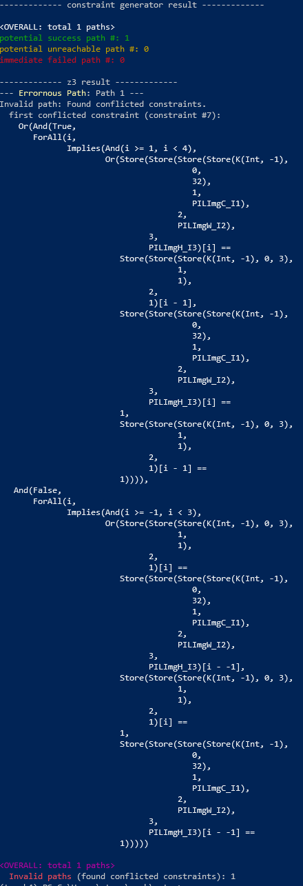

# PyTEA: Python Tensor Error Analyzer

## Requirements

- `node.js >= 12.x`
- `python >= 3.8`
  - `z3-solver >= 4.8`

## How to build and use

```bash
# install dependencies
npm run install:all
pip install z3-solver

# build
npm run build

# analyze
python bin/pytea.py path/to/source.py
```

## Documentations

* [Configuration](doc/config.md)
* [Build and Debug](doc/build-and-debug.md)

## Brief Explanation of Analysis Result

For a full explanation, see [result-explain.md](doc/result-explain.md)

PyTea is composed with two analyzer.

* Online analysis: TypeScript / JavaScript
  * Find numeric range based shape mismatch and misuse of API argument. If any error is found while analyzing the code, it will stop at that position and inform the errors and violated constraints to the user.
* Offline analysis: Z3 / Python
  * If online analyzer cannot assure that the shape requirement can be violated, it will pass on constraints to [Z3Py](https://github.com/Z3Prover/z3).


The result of Online analyzer is divided into three classes:
* **potential success path**: the analyzer does not found shape mismatch until now, but the final constraint set can be violated if Z3 analyzes it on closer inspection.
* **potential unreachable path**: the analyzer found shape mismatch or API misuses, but there remains *path constraints*. In short, *Path constraints* are uncertain branch conditions with symbolic variables; that means the stopped path might be *unreachable* if some path constraints mutually contradicts. Those cases will be distinguished from *Offline analysis*.
* **immediate failed path**: the analyzer founds errors, and stops its analysis immediately.

*CAVEAT*: If the code contains PyTorch or other third-party APIs that we have not implemented, it will raise false alarms. But we also record each unimplemented API calls. Use `--log=2` option to see which unimplemented API call is performed.


The final result of Offline analyzer is divided into sevral cases.
* **Valid path**: SMT solver have not found any error. Every constraints will always be fulfilled
* **Invalid path**: SMT solver found a condition that can violate some constraints. Notice that this does not mean your code will always be crashed, but it found an extreme case that crashs some executions.
* **Unreachable path**: Hard and Path constraints contain contradicting constraints; this path will not be realized from the beginning.
* **Undecidable path**: The solver have met unsolvable constraints and timeouted. Some non-linear formulae can be classified into this case.


### Result examples

* Error found by Offline analysis

```bash
> python bin/pytea.py --log=1 packages/pytea/pytest/benchmarks/resnet_simclr/resnet_train.py
```


* Error found by Online analysis

```bash
> python bin/pytea.py --log=1 packages/pytea/pytest/benchmarks/fast_neural_style/neural_style/neural_style.py
```



Offline analyzer have found a conflicted constraint (#7). Then, run `pytea.py` with `--log=2` to find code position of violated constraint.