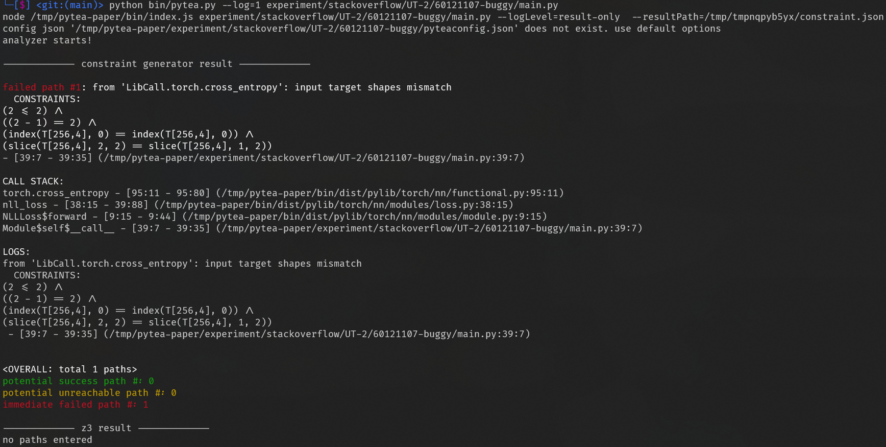
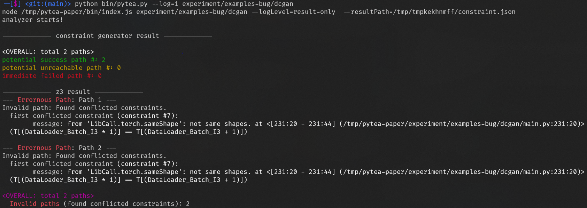

# PyTea: PyTorch Tensor Shape Error Detection
## Requirements

- `node.js >= 12.x`
- `python >= 3.8`
  - `z3-solver >= 4.8`

## How to build and use

```bash
# install dependencies
npm run install:all
pip install z3-solver

# build
npm run build

# analyze
python bin/pytea.py path/to/source.py
```

## Documentations

* [Configuration](doc/config.md)
* [Build and Debug](doc/build-and-debug.md)

## Brief explanation of the analysis result

PyTea is composed with two analyzers.

- Online analysis: node.js (TypeScript / JavaScript)
  - Find numeric range based shape mismatch and misuse of API argument. If PyTea found any error while analyzing the code, it will stop at that position and inform the errors and violated constraints to the user.
- Offline analysis: Z3 / Python
  - The generated constraints are passed to [Z3Py](https://github.com/Z3Prover/z3). Z3 will solve the constraint sets of each paths and print the first violated constraint (if exists).

The result of Online analyzer is divided into three classes:

- **potential success path**: the analyzer does not found shape mismatch until now, but the final constraint set can be violated if Z3 analyzes it on closer inspection.
- **potential unreachable path**: the analyzer found shape mismatch or API misuses, but there remains _path constraints_. In short, _path constraint_ is unresolved branch condition; that means the stopped path might be _unreachable_ if remained path constraints have contradiction. Those cases will be distinguished from _Offline analysis_.
- **immediate failed path**: the analyzer founds errors, and stops its analysis immediately.

_CAVEAT_: If the code contains PyTorch or other third-party APIs that we have not implemented, it will raise false alarms. But we also record each unimplemented API calls. See `LOGS` section from result and search which unimplemented API call is performed.

The final result of the Offline analysis is divided into several cases.

- **Valid path**: SMT solver has not found any error. Every constraint will always be fulfilled.
- **Invalid path**: SMT solver found a condition that can violate some constraints. Notice that this does not mean the code will always crash, but it found an extreme case that crashes some executions.
- **Undecidable path**: SMT solver has met unsolvable constraints, then timeouted. Some non-linear formulae can be classified into this case.
- **Unreachable path**: Hard and Path constraints contain contradicting constraints; this path will not be realized from the beginning.

### Result examples

- Error found by Online analysis



- Error found by Offline analysis


# License

MIT License

This project is based on [Pyright](https://github.com/microsoft/pyright), also [MIT License](https://github.com/microsoft/pyright/blob/master/LICENSE.txt)
